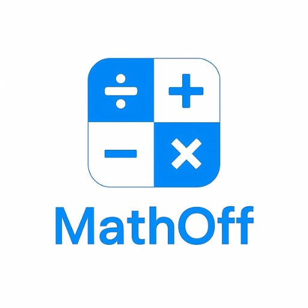

<p align="center">
  
</p>

# MathOff

**MathOff** é um aplicativo mobile de perguntas e respostas matemáticas, com uma proposta lúdica e interativa para reforçar o aprendizado por meio de um quiz gamificado.  
O projeto é focado no público estudantil e utiliza feedback visual e sonoro para tornar a experiência educativa mais envolvente.

---

## Objetivo do Projeto

Desenvolver um aplicativo de quiz matemático para dispositivos móveis que:

- Estimule o raciocínio lógico de forma divertida;
- Incentive o aprendizado da matemática por meio da gamificação;
- Ofereça uma plataforma acessível para alunos de diversas idades.

---

## Tecnologias Utilizadas

- **React Native** com Expo  
- **TypeScript**  
- **Firebase Authentication (REST API)**  
- **Context API** para gerenciamento de pontuação  
- **EAS Build** para empacotamento do app  
- **Assets multimídia** (sons, imagens e logo personalizados)

---

## 👥 Integrantes do Projeto

- **João Pedro Silva de Oliveira**  
- **Diogo Marques Moreira**

### 🎓 Orientador

- **Prof. Jeferson Roberto De Lima**

---

## ▶️ Como Executar o Projeto

Você pode experimentar o **MathOff** diretamente no seu dispositivo Android.

**Acesse a Play Store e faça o download:**  
[https://play.google.com/store/apps/details?id=com.dgmarques.MathOff&hl=pt_BR](https://play.google.com/store/apps/details?id=com.dgmarques.MathOff&hl=pt_BR)

---

## Como Contribuir

1. Faça um fork deste repositório.  
2. Crie uma nova branch com a sua feature ou correção:

```bash
git checkout -b minha-feature
